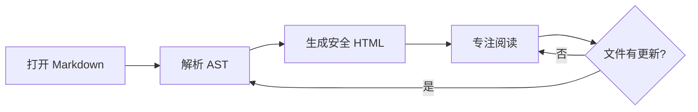

# Mermaid 视觉验证

下图必须直接显示为流程图，而不是代码块。工具栏应提供缩小、适应宽度和放大，图表区域支持拖动平移。

```mermaid
flowchart LR
    OPEN["打开 Markdown"] --> PARSE["解析 AST"]
    PARSE --> SAFE["生成安全 HTML"]
    SAFE --> READ["专注阅读"]
    READ --> UPDATE{"文件有更新?"}
    UPDATE -->|是| PARSE
    UPDATE -->|否| READ
```

[返回 UI Walk 样本文档](UI_WALK_SAMPLE.md)
